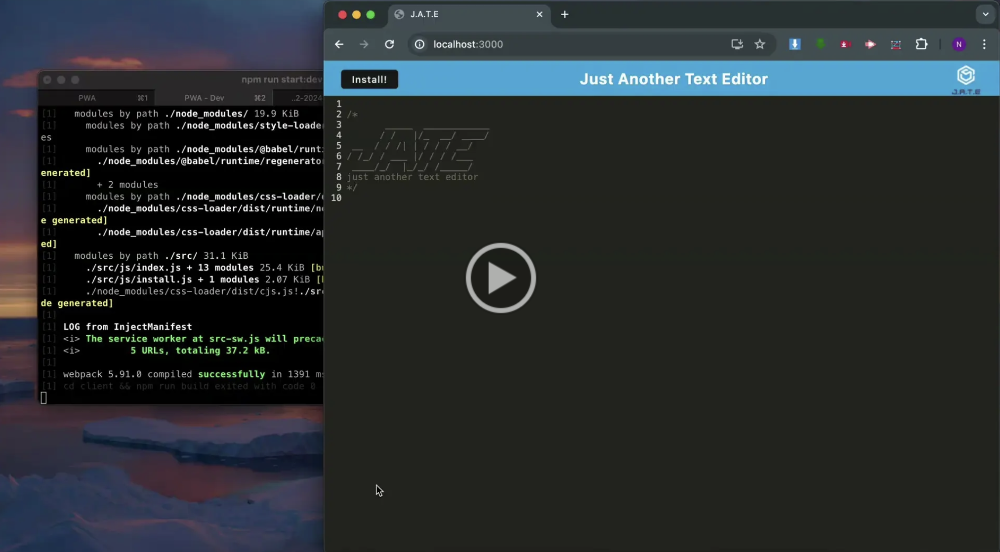

# Challenge 19

## PWA Text Editor

In this project I created a progressive web app text editor. This is a single page web application that meets PWA criteria and it features a number of data persistent techniques. While some of it may seem redundant, this helps the user to use the app seamlessly if one of the options are not supported by the browser.

## Link

https://pwa-text-editor-u1c9.onrender.com

## Screenshots | Screen Recordings

### PWA Launch Page

![[Screenshot of Github Live Page]](assets/pwa-homepage.png)

### PWA - Manifest

![[Screenshot of Github Live Page]](assets/pwa-manifest.png)

### PWA - Service Worker

![[Screenshot of Github Live Page]](assets/pwa-sw.png)

### PWA - IndexDB

![[Screenshot of Github Live Page]](assets/pwa-indexdb.png)

### Walkthrough of PWA

